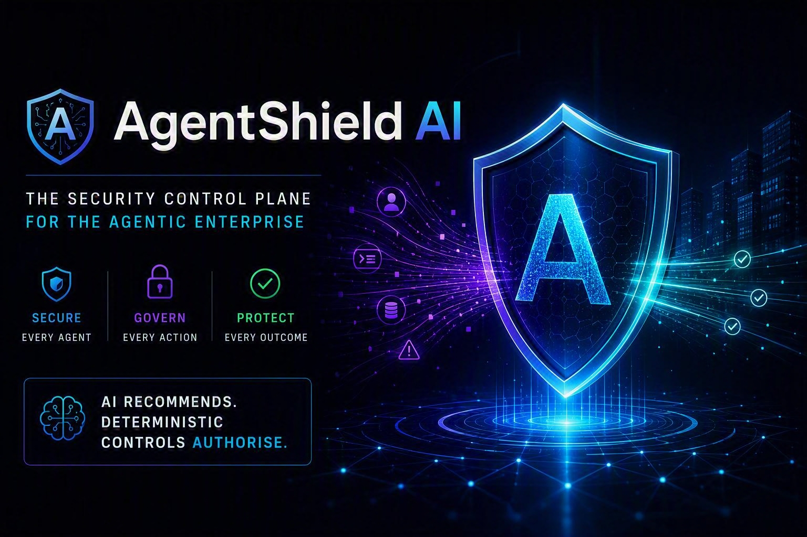
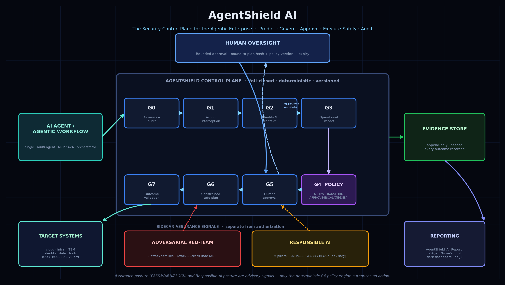

# AgentShield AI



**The Security Control Plane for the Agentic Enterprise**

> Predict. Govern. Approve. Execute Safely. Audit.

AgentShield AI is a governance and assurance agent for AI agents, agentic
solutions, and deployment or orchestration systems. It audits an agent's design,
evaluates a proposed action before it reaches a target, predicts operational
impact, applies deterministic policy, routes human approval, produces a
constrained safe plan, validates observed behavior, and preserves evidence.

AgentShield keeps two decisions strictly separate:

| Assurance posture | Runtime decision |
|---|---|
| `PASS` / `WARN` / `BLOCK` | `ALLOW` / `TRANSFORM` / `APPROVE` / `ESCALATE` / `DENY` |
| Confidence in design and controls | Authorization for one proposed action |

**`PASS` is not certification.** An agent may pass assurance and still have a
dangerous action denied. A `WARN` agent may still perform an eligible low-risk
read-only operation. A `BLOCK` agent must not perform write operations.

## How it fits together

AgentShield is organised into two strictly separated lanes plus the surfaces
that drive them:

- **Deterministic core (`agentshield/`)** &mdash; the offline, network-free
  assessment and governance engine. It never makes outbound calls, so its verdicts
  are reproducible and safe to run anywhere. This is what authorizes or denies an
  action.
- **Live measurement lane (`agentshield_live/`)** &mdash; opt-in adapters that
  gather *real* signals (red-team probes, content-safety checks, fairness/RAI
  measurements). All networking lives here and never leaks into the core.
- **Surfaces** &mdash; a Copilot **custom agent** (`.github/agents/`), a report
  **pipeline** (`scripts/`), and a **Next.js website** (`agentshield-web/`)
  deployed to Azure Container Apps.



## Repository structure

```text
AgentShield/
├── agentshield/                  Deterministic assessment & governance engine (offline, no network)
│   ├── workflow.py               Orchestrates the seven gates end to end
│   ├── assurance.py              Gate 0 — control-family scoring → PASS / WARN / BLOCK
│   ├── interception.py           Gate 1 — capture & hold a proposed action
│   ├── impact.py                 Gate 3 — operational-impact scoring
│   ├── policy.py                 Gate 4 — deterministic ALLOW/TRANSFORM/APPROVE/ESCALATE/DENY
│   ├── approvals.py              Gate 5 — approval binding (requester, action, plan hash, expiry)
│   ├── planning.py               Gate 6 — constrained safe plan with stop conditions
│   ├── validation.py             Gate 7 — expected-vs-observed outcome validation
│   ├── redteam.py                Static red-team scoring (defense coverage, residual exposure)
│   ├── responsible_ai.py         Six-pillar Responsible AI posture (RAI-PASS/WARN/BLOCK)
│   ├── static_assess.py          Parse an agent definition into evidence
│   ├── remediation.py            Finding → concrete remediation suggestions
│   ├── sarif.py                  SARIF export for code-scanning dashboards
│   ├── evidence.py · ledger.py   Evidence records + tamper-evident audit ledger
│   ├── determinism.py · metrics.py · models.py · interfaces.py   Core primitives
│   ├── mock_providers.py         Synthetic providers (keeps the core testable & offline)
│   └── integrations/             Optional Entra ID / Content Safety hooks
├── agentshield_live/             Live-measurement lane (all networking is isolated here)
│   ├── redteam_live.py           Live adversarial probes
│   ├── pyrit_engine.py           PyRIT-backed attack generation
│   ├── content_safety_live.py    Azure AI Content Safety checks
│   ├── fairness.py · rai_measured.py   Measured fairness & Responsible AI metrics
│   ├── judge.py · canary.py · adapters.py   Scoring, canaries, provider adapters
│   └── data/                     Sample datasets (bring-your-own-dataset)
├── scripts/                      Report pipeline & CLI entry points
│   ├── agentshield_report.py     Full assessment → HTML evidence report
│   ├── agent_llm.py              LLM enrichment + content-addressed narrative cache
│   ├── agentshield_scan.py       Static scan of an agent definition
│   ├── agentshield_observe.py    OBSERVE mode — predicted impact + would-be decision
│   ├── agentshield_intercept.py  Action interception demo
│   ├── agentshield_governance.py GOVERN mode runner
│   ├── agentshield_showcase.py   End-to-end showcase
│   └── agentshield_banner*.py    CLI banner (ANSI + PNG)
├── enrichment_cache/             Committed LLM narratives, namespaced by prompt version
│   └── v1/                       Ensures the website and CLI render identical reports
├── agentshield-web/              Next.js website (Azure Container Apps) — upload an agent, get a report
├── deploy/                       Azure Container Apps deployment scripts (ps1 / sh / portal guide)
├── Protocols/                    Authoritative behavioural protocols (governance + Responsible AI)
├── Templates/                    Assessment & Responsible AI report templates
├── examples/                     Sample assessment inputs/outputs (dr-sha, troubleshootbuddy…)
├── evals/                        Evaluation harness & baseline/optimized result sets
├── reference-agent/             Structural/quality reference agent (audit report + flow)
├── docs/                         Architecture image, banner, generated reports, LIVE-ASSESSMENT.md
├── tests/                        Synthetic, mock-backed test suite (161 tests)
├── .github/
│   ├── agents/agentshield.agent.md          Custom Copilot agent definition
│   ├── skills/agentshield-html-report/      Explicit-trigger HTML report skill
│   ├── workflows/                           CI: deploy + enrichment-parity gate
│   └── copilot-instructions.md              Repository guardrails
├── Dockerfile · DEPLOYMENT.md    Container build + deployment guide
├── AGENTS.md                     Contributor/agent operating notes
└── AgentShield.txt               Original build brief
```

## Operating modes

1. **ASSESS** &mdash; evidence-based assurance posture; no target execution.
2. **OBSERVE** &mdash; predict impact and show the decision that would occur.
3. **GOVERN** &mdash; enforce deterministic policy and route approval; no
   execution by AgentShield.
4. **CONTROLLED LIVE** &mdash; future production mode, **disabled by default** and
   unavailable without a genuine, approved, least-privileged adapter.

## Seven gates

0. Assurance audit &rarr; 1. Action interception &rarr; 2. Identity & assurance
context &rarr; 3. Operational impact &rarr; 4. Deterministic policy &rarr;
5. Human approval &rarr; 6. Constrained safe plan &rarr; 7. Outcome validation.

See the architecture diagram above for the visual workflow and
`Protocols/AGENTSHIELD-PROTOCOL.md` for authoritative behavior.

## Responsible use and limitations

AgentShield AI provides security assurance and governance **support**, not
certification, legal advice, compliance approval, or a guarantee of safety. It
evaluates only supplied and accessible evidence, distinguishes design intent from
implemented and tested controls, fails closed on high-risk uncertainty, and never
lets an LLM grant authorization. Human owners remain accountable for their
systems, approvals, and production changes.

All identities, targets, hostnames, and records in this repository are fictional.
